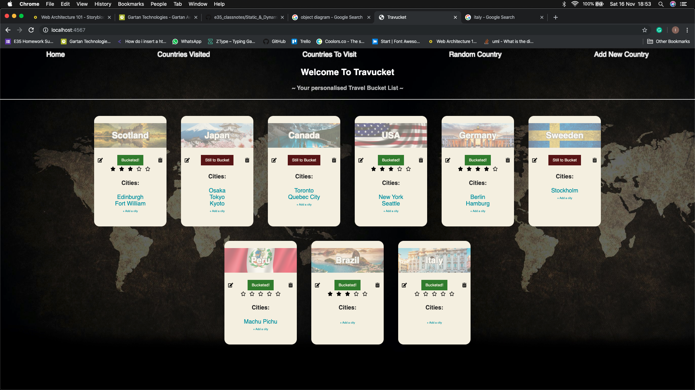

# Travucket
A Travel Bucket List app

This app was created as a solo project for CodeClan. It was created using Ruby, Sinatra and PostgreSQL.

Travucket was my first attempt at a project since starting at CodeClan. The major learning curve from this project was the importance of planning.

``
To Setup:
Create a new PostgreSQL table called 'travucket' by typing 'createdb travucket' in terminal
``
``
Create the tables by typing 'psql -d travucket -f db/travucket.sql' from the route directory.
``

``
To run:
While in the route directory type 'ruby travucket.rb'
``
